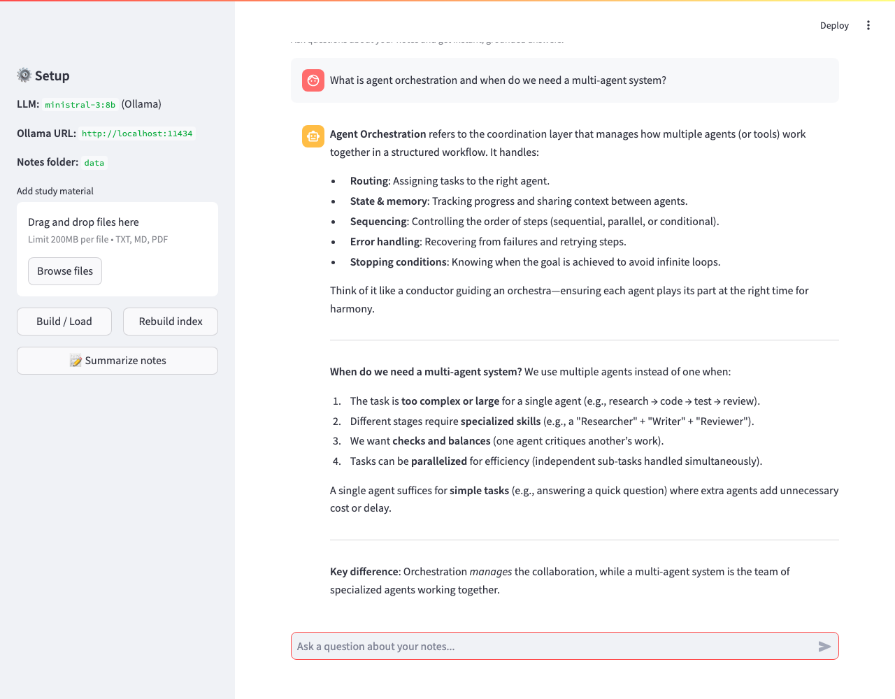

# 📚 Study Assistant AI

> An AI-powered study companion that summarizes your notes and answers your
> questions — running **100% locally** on your own machine using a local LLM
> (via [Ollama](https://ollama.com)). No API keys. No cloud. Your notes never
> leave your laptop.

<p align="center">
  <a href="https://github.com/swaroopramv/study-assistant-ai/actions/workflows/ci.yml"></a>
  
  
  
  
  
  
</p>

<p align="center">
  <i>If you find this project useful, please consider giving it a ⭐ — it helps others discover it!</i>
</p>

---

## ✨ Features

- **💬 Chat with your notes** — ask questions and get answers grounded in *your*
  study material (`.txt`, `.md`, `.pdf`).
- **🔒 Fully local & private** — powered by a local Ollama model; no API keys,
  no internet, no data sharing.
- **📝 One-click summaries** — condense all your notes into clear, topic-grouped
  bullet points.
- **📤 Upload from the UI** — drag in new files and re-index instantly.
- **🧠 Retrieval-Augmented Generation (RAG)** — answers cite only what's in your
  notes, reducing hallucinations.
- **⚡ Local FAISS vector store** — fast similarity search, no external database.

---

## 🖼️ Demo

<!-- Add a screenshot of the running app here. Save it as docs/demo.png and
     it will render automatically. -->
<p align="center">
  
</p>

Example interaction:

```text
You:  What is agent orchestration and when do we need a multi-agent system?

📚:   Agent orchestration is the coordination layer that manages how multiple
      agents and tools work together — handling routing, shared state, step
      sequencing, error handling, and stopping conditions...
      We need multi-agent systems when a task is too complex for one agent,
      needs different specialised skills, or benefits from checks and balances.
```

> _No screenshot yet? Run the app, take a screenshot of the browser, save it as
> `docs/demo.png`, and it will appear above automatically._

---

## 🏗️ Architecture

```text
                ┌──────────────────────────────────────────────┐
                │                Streamlit UI                   │
                │        (chat • upload • summarize)            │
                └───────────────────────┬──────────────────────┘
                                        │
                                        ▼
        ┌───────────────────────────────────────────────────────────┐
        │                    RAG Pipeline (LangChain)                │
        │                                                            │
        │   data/  ──►  Load & Split  ──►  Embeddings  ──►  FAISS    │
        │  (.txt/.md/.pdf)               (nomic-embed-text)  index   │
        │                                                            │
        │   Question ──► Retrieve top-k chunks ──► Prompt + Context  │
        │                                              │             │
        └──────────────────────────────────────────────┼────────────┘
                                                        ▼
                                          ┌──────────────────────────┐
                                          │   Local LLM via Ollama    │
                                          │     (ministral-3:8b)      │
                                          └──────────────────────────┘
                                                        │
                                                        ▼
                                              Grounded Answer
```

---

## 🛠️ Tech Stack

| Layer            | Technology                                   |
| ---------------- | -------------------------------------------- |
| Language         | Python 3.9+                                   |
| RAG / Orchestration | LangChain                                  |
| LLM              | Ollama — `ministral-3:8b` (chat)              |
| Embeddings       | Ollama — `nomic-embed-text`                   |
| Vector Store     | FAISS (local)                                 |
| Web UI           | Streamlit                                     |
| Doc Loading      | pypdf, LangChain loaders                       |

---

## 📂 Project Structure

```text
study-assistant-ai/
├── README.md
├── CONTRIBUTING.md
├── LICENSE
├── pyproject.toml          # ruff + pytest config
├── requirements.txt
├── .env.example            # configuration template
├── .github/workflows/ci.yml  # GitHub Actions CI (lint + tests)
├── app.py                  # Streamlit web UI
├── data/
│   └── notes.txt           # your study material
├── scripts/
│   └── capture_demo.py     # screenshot helper for the README
├── tests/
│   └── test_rag_helper.py  # offline unit tests
└── utils/
    ├── __init__.py
    └── rag_helper.py        # loading, indexing, QA & summary chains
```

---

## 🚀 Getting Started

### Prerequisites

- **Python 3.9+**
- **[Ollama](https://ollama.com/download)** installed and running.

### 1. Clone the repository

```bash
git clone https://github.com/swaroopramv/study-assistant-ai.git
cd study-assistant-ai
```

### 2. Set up a virtual environment & install dependencies

```bash
python -m venv .venv
source .venv/bin/activate        # Windows: .venv\Scripts\activate
pip install -r requirements.txt
```

### 3. Pull the local models (one-time)

```bash
ollama pull ministral-3:8b       # chat model (or your preferred model)
ollama pull nomic-embed-text     # embedding model
```

> Make sure Ollama is running (`ollama serve`). Verify your models with
> `ollama list`.

### 4. (Optional) Configure

Copy the template and tweak it if you want a different model or host:

```bash
cp .env.example .env
```

| Variable          | Default                  | Description                        |
| ----------------- | ------------------------ | ---------------------------------- |
| `OLLAMA_BASE_URL` | `http://localhost:11434` | Ollama server URL                  |
| `CHAT_MODEL`      | `ministral-3:8b`         | Local model used for answers       |
| `EMBED_MODEL`     | `nomic-embed-text`       | Local model used for embeddings    |

### 5. Add your notes

Drop your `.txt`, `.md`, or `.pdf` files into the `data/` folder (a sample
`notes.txt` is included), or upload them later from the UI.

### 6. Run the app

```bash
streamlit run app.py
```

Open the URL shown in the terminal (usually <http://localhost:8501>), click
**Build / Load**, and start asking questions. 🎉

---

## 🧠 How It Works

1. **Load** — files in `data/` are read with the appropriate loader
   (`.txt`/`.md`/`.pdf`).
2. **Split** — documents are chunked (1000 chars, 150 overlap) for better
   retrieval.
3. **Embed & Index** — chunks are embedded locally and stored in a FAISS index
   (`faiss_index/`).
4. **Retrieve** — for each question, the top-k most relevant chunks are fetched.
5. **Generate** — the chunks + your question are sent to the local LLM, which
   returns an answer grounded only in your notes.

---

## 🧪 Testing & Code Quality

The project ships with an offline unit-test suite (no Ollama server required)
and is linted/formatted with [ruff](https://docs.astral.sh/ruff/).

```bash
pip install ruff pytest
ruff check .        # lint
ruff format .       # auto-format
pytest              # run tests
```

Every push and pull request is automatically validated by
**GitHub Actions** (lint + tests on Python 3.9 and 3.11) — see the CI badge at
the top.

---

## 🐍 Programmatic Use

You can use the RAG helpers directly without the UI:

```python
from utils.rag_helper import answer_question, summarize_notes

# Ask a question against your notes
print(answer_question("What is agent orchestration?"))

# Summarize all notes into topic-grouped bullet points
print(summarize_notes())
```

---

## 🩺 Troubleshooting

| Problem | Fix |
| ------- | --- |
| `This server does not support embeddings` | Pull a dedicated embedding model: `ollama pull nomic-embed-text`. |
| `No study material found` | Add files to `data/` or upload them in the UI. |
| Connection refused to `localhost:11434` | Start Ollama with `ollama serve`. |
| Answers seem stale after editing notes | Click **Rebuild index** in the UI (or delete the `faiss_index/` folder). |

---

## 🗺️ Roadmap

- [ ] Show source citations alongside answers
- [ ] Streaming responses in the UI
- [ ] Conversation memory across turns
- [ ] Support for more file types (DOCX, HTML)
- [ ] Dockerfile for one-command setup

---

## 🤝 Contributing

Contributions are welcome! To propose a change:

1. Fork the repo and create a feature branch (`git checkout -b feature/my-idea`).
2. Commit your changes (`git commit -m "Add my idea"`).
3. Push the branch and open a Pull Request.

Please keep changes focused and include a clear description.

---

## 📄 License

Released under the **MIT License**. See [`LICENSE`](LICENSE) for details.

---

## 🙌 Acknowledgements

- [Ollama](https://ollama.com) for effortless local LLMs
- [LangChain](https://www.langchain.com) for the RAG tooling
- [FAISS](https://github.com/facebookresearch/faiss) for fast vector search
- [Streamlit](https://streamlit.io) for the UI
